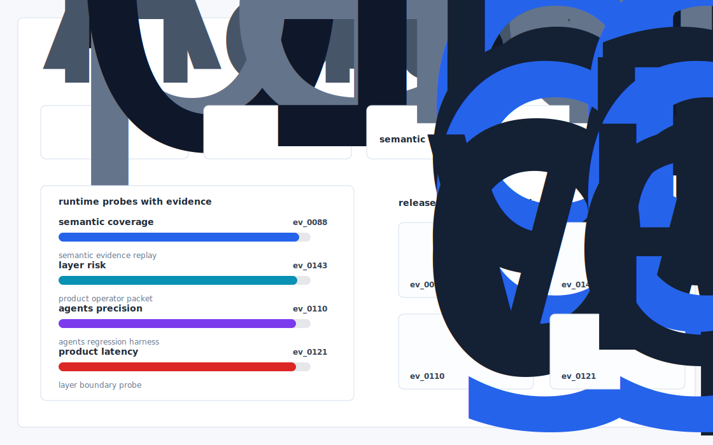
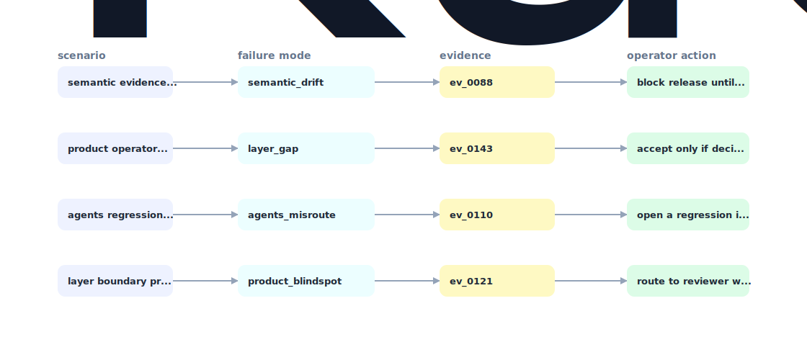

# Groundtruth Eval

An open benchmark + harness that scores any context layer grounded analytics agent on natural language -> governed metric correctness, designed to make Kaelio the reference standard.



## Why it exists

A semantic layer for agents product has one bet the company question: when the agent answers, was the answer correct against the governed definition? Kaelio's marketing copy says "metrics defined in five places, governed in none" (kaelio.com) — but the only artifact a buyer sees today is a homepage and a list of integrations.

The project is intentionally built as a local replay harness instead of a slide. It creates fixtures, plants realistic failure modes, produces citation-locked evidence, and turns the result into a dashboard a reviewer can inspect without credentials or hosted services.

## What is inside

- Deterministic fixture generation for the company-specific risk surface.
- Strategy code in `src/groundtruth_eval/strategy.py` with project-specific scoring and visual evidence.
- Citation-locked reports where every decision claim points to a generated evidence ID.
- Two regenerated visual artifacts: `outputs/project_working.svg` and `outputs/evidence_map.svg`.
- A portable demo pack with JSON, CSV, Markdown, HTML, SVG, benchmark, and test artifacts.



## Signals it measures

- `semantic coverage`
- `layer risk`
- `agents precision`
- `product latency`

## Failure modes it plants

- semantic drift
- layer gap
- agents misroute
- product blindspot

## Run it locally

```bash
uv sync
uv run groundtruth-eval all
uv run pytest -q
uv run ruff check .
```

## Outputs worth opening

- `outputs/dashboard.html`
- `outputs/project_working.svg`
- `outputs/evidence_map.svg`
- `outputs/operator_brief.md`
- `outputs/decision_report.md`
- `outputs/strategy_model.json`
- `outputs/demo_pack.zip`

## Sources

- https://www.kaelio.com/blog/best-ai-analytics-tools-for-healthcare-organizations
- https://www.kaelio.com/blog/best-semantic-layer-solutions-for-data-teams-2026-guide
- https://www.kaelio.com/blog/best-ai-analytics-tools-that-work-with-dbt-and-lookml
- https://www.ycombinator.com/companies/kaelio
- https://x.com/ycombinator/status/1924465068487667748
- https://www.linkedin.com/in/luca-martial/
- https://github.com/luca-martial
- https://github.com/JohnSnowLabs/spark-nlp
- https://github.com/Giskard-AI/giskard

## Boundary

Everything runs locally against synthetic fixtures. There are no credentials, no customer records, no outreach files, and no hosted API dependency.
